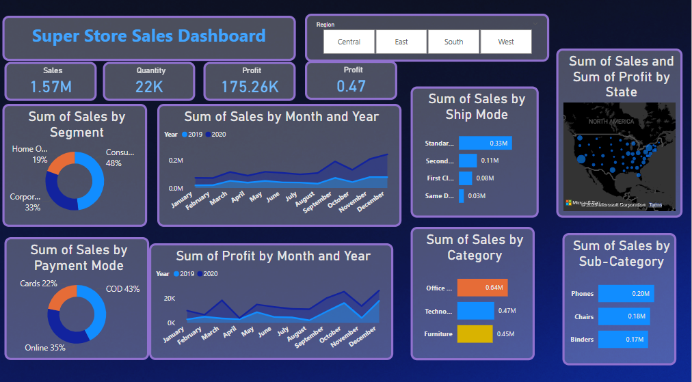

# 📈 Superstore Sales Performance Dashboard & Forecasting – Power BI

An interactive Power BI dashboard that provides a comprehensive view of a retail superstore's sales performance, profitability trends, customer segments, and a **15-day sales forecast** using built-in time-series analytics.

---

## 🧩 Project Highlights

- 📊 **Sales Dashboard** with KPIs: Sales, Profit, Quantity, and Profit Ratio
- 🌍 **Regional & State-level** sales distribution using a map visual
- 🔎 Drill-down capabilities for Product Categories, Sub-categories, Segments, and Payment Modes
- 📅 **Time-series analysis** of monthly sales and profits (2019–2020)
- 📦 Sales performance by **Shipping Mode**
- 🔮 **15-day Forecasting** with dynamic trend visuals and confidence intervals

---

## 📷 Screenshots

### 🎯 Sales Performance Dashboard

### 🔮 Sales Forecasting View (15-Day Projection)

---

## 🛠️ Tools & Technologies

- **Power BI Desktop**
- **DAX (Data Analysis Expressions)**
- **Power Query (M)**
- **Forecasting (built-in analytics visual)**
